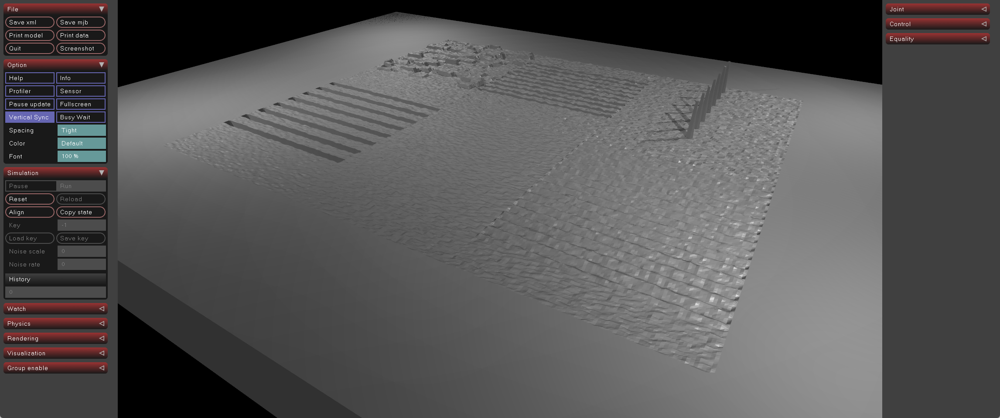
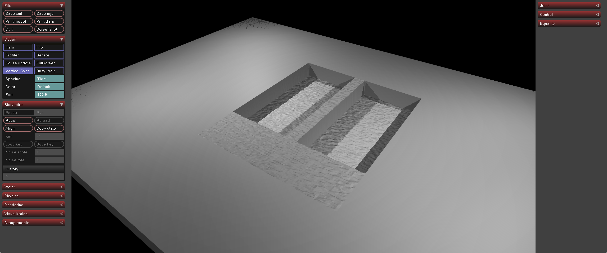
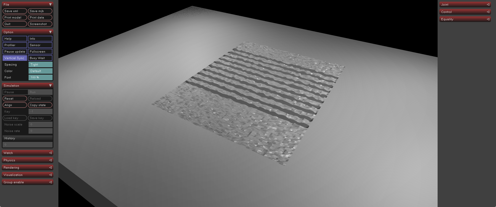
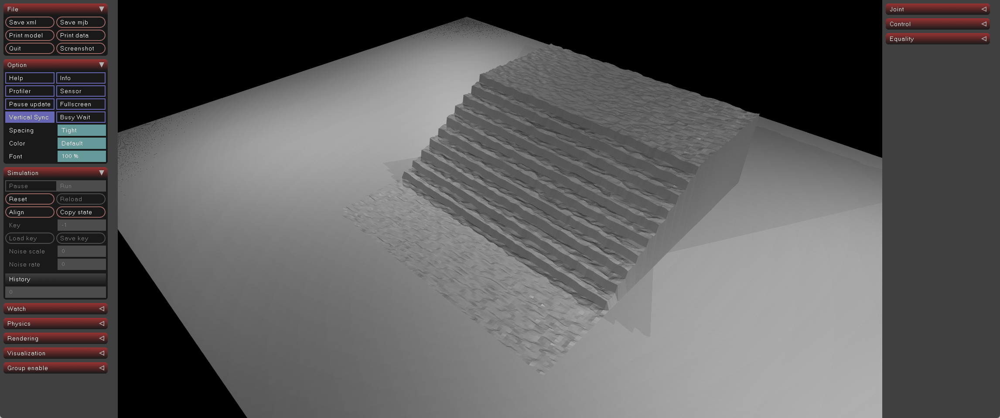

# MuJoCo HTB Terrain HField Generator

This project extracts the terrain generation logic from Humanoid-Terrain-Bench
and exports MuJoCo-loadable `hfield` terrain assets. It is terrain-only: it
does not include humanoid robot models, controllers, rewards, training
environments, evaluation code, or policies.

The default output is a MuJoCo height field, not a large mesh. This keeps large
terrain grids compact and practical to load in MuJoCo.

## Install

```bash
pip install -r requirements.txt
```

## Export Default Terrain

```bash
python export_mujoco_hfield.py --out generated --rows 2 --cols 3 --seed 0 --preview
```

The output directory is created automatically. Generated output directories are
ignored by git and are not part of the release source tree.

## Export One Terrain Type

```bash
python export_mujoco_hfield.py --out generated_stair --terrain stair --difficulty 0.8 --single --preview
```

Available terrain names are `parkour`, `hurdle`, `bridge`, `flat`, `uneven`,
`stair`, `wave`, `slope`, `gap`, and `plot`.

## Visualize

```bash
python visualize_mujoco.py --xml generated/htb_terrain.xml
```

## Validate

```bash
python test_mujoco_load.py --out generated
```

The validation script checks the binary hfield header, file size, metadata
shape, and MuJoCo XML loading.

## Output Files

- `htb_terrain.hfield`: MuJoCo hfield binary file.
- `htb_terrain.xml`: minimal MJCF scene referencing the hfield.
- `terrain_height_m.npy`: metric height field in meters.
- `terrain_height_raw.npy`: raw int16 height units.
- `terrain_metadata.json`: export settings, shape, scale, origin, goal, terrain type, and light metadata.
- `preview.png`: optional static preview when `--preview` is used.

Preview PNGs and generated terrain outputs are ignored by default. If future
README or documentation images should be committed, put them under
`docs/images/`; `.gitignore` keeps `docs/images/*.png` as an exception.

## XML Contents

The default XML contains the hfield terrain geom and four static lights
automatically positioned at the terrain corners. These lights are for
visualization only and do not change the height data.

The default XML does not include a robot or test ball. To add a free sphere for
a quick hfield collision check, pass:

```bash
python export_mujoco_hfield.py --out generated --add-test-ball
```

The test ball is not part of the terrain.

## Orientation Options

If the MuJoCo viewer orientation does not match the preview, export with:

```bash
python export_mujoco_hfield.py --transpose
python export_mujoco_hfield.py --flip-x
python export_mujoco_hfield.py --flip-y
```

The operations are applied in this order: transpose, flip x/rows, flip
y/columns.

## Size Options

```bash
python export_mujoco_hfield.py --rows 2 --cols 3 --terrain-length 10 --terrain-width 4
python export_mujoco_hfield.py --horizontal-scale 0.05 --vertical-scale 0.005
```

`horizontal_scale` is the x/y grid spacing in meters. `vertical_scale` converts
raw int16 height units to meters.

## Dependencies Not Required

This release does not require Isaac Gym, Legged Gym, RSL-RL, torch/PyTorch,
wandb, pyfqmr, or pydelatin. It does not require the original simulator or
training stack.

## Terrain examples

The exporter can generate both mixed HTB-style terrain maps and individual terrain types. Each terrain is exported as a MuJoCo `hfield` asset together with a minimal MJCF file for visualization and simulation.

> The screenshots below are rendered in MuJoCo from the generated `htb_terrain.xml` files. The grey border around each terrain is the hfield base area used by MuJoCo.

### Mixed terrain map

The default multi-tile export combines several terrain primitives into one heightfield map, including stairs, waves, uneven ground, gaps, and obstacle-like structures. This is useful for quickly checking whether the exporter can stitch multiple HTB terrain types into a single MuJoCo-compatible hfield.

```bash
python export_mujoco_hfield.py --out generated --rows 2 --cols 3 --seed 0 --preview
python visualize_mujoco.py --xml generated/htb_terrain.xml
```



### Bridge terrain

The bridge terrain contains narrow elevated paths and lower surrounding regions. It is useful for testing balance, foot placement, and traversal over constrained support areas.

```bash
python export_mujoco_hfield.py --out generated_bridge --terrain bridge --difficulty 0.8 --single --preview
python visualize_mujoco.py --xml generated_bridge/htb_terrain.xml
```



### Gap terrain

The gap terrain creates separated traversable regions with depressions or missing sections between them. It is useful for testing stepping, jumping, or gap-crossing behaviors in a MuJoCo-based locomotion environment.

```bash
python export_mujoco_hfield.py --out generated_gap --terrain gap --difficulty 0.8 --single --preview
python visualize_mujoco.py --xml generated_gap/htb_terrain.xml
```



### Stair terrain

The stair terrain creates a stepped heightfield with configurable difficulty. It is useful for testing stair-climbing behavior and validating that height discontinuities are preserved after conversion to MuJoCo hfield format.

```bash
python export_mujoco_hfield.py --out generated_stair --terrain stair --difficulty 0.8 --single --preview
python visualize_mujoco.py --xml generated_stair/htb_terrain.xml
```


